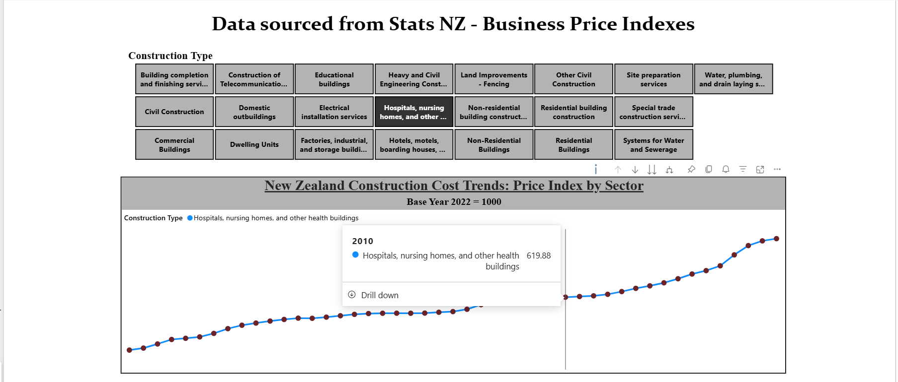

# NZ Construction Price Index: End-to-End Data Pipeline

## Python | AWS | Snowflake | Power BI

### 1. Project Overview

This project is a comprehensive data engineering solution that automates the collection, storage, and visualization of New Zealand’s construction cost data (1979–2026). It demonstrates a complete lifecycle from custom Python extraction to a cloud-based analytical dashboard.

### 2. The Full Data Journey

The pipeline follows a modern data stack architecture to ensure scalability and reliability:

- **Phase 1: Extraction (Python):** Developed a custom Python script using `requests` and `pandas` to programmatically fetch the latest Business Price Index datasets directly from the **Stats NZ** web portal, replacing manual downloads.
- **Phase 2: Cloud Landing (AWS S3):** Configured an **AWS S3** bucket as the landing zone (Data Lake) for raw CSV files, providing a durable and centralized storage solution.
- **Phase 3: Data Warehousing (Snowflake):** Implemented a **Medallion Architecture**:
  - **Bronze:** Raw ingestion from S3 using external stages.
  - **Silver:** Data cleaning, handling nulls, and schema enforcement.
  - **Gold:** Final business views in Snowflake where I mapped decimal periods to standard dates and categorized 20+ construction types into "Residential" and "Commercial" sectors.
- **Phase 4: Analytics (Power BI):** Connected Power BI to Snowflake via Secure OAuth2 to visualize the **Base Year Indexing (2022=1000)** for inflation tracking.

### 3. Technical Proficiencies

- Data Extraction & API Handling: requests

- Data Transformation: pandas

- Cloud Integration: boto3 (AWS SDK)

- Environment Security: python-dotenv

### 4. Challenges & Solutions

Every engineering project has its hurdles. Below are the key technical challenges I faced and how I resolved them:

- **Character Encoding Mismatch (ISO-8859-1 vs. UTF-8):**
- _Problem:_ The initial Python extraction failed because the Stats NZ CSV files used `ISO-8859-1` encoding. Standard `utf-8` readers produced `UnicodeDecodeError` or corrupted text characters.
- _Solution:_ I modified the Python requests and pandas workflow to explicitly handle the `ISO-8859-1` encoding during the read_csv process, ensuring that the construction type names remained intact and readable for downstream analytics.

- **Non-Standard Date Formats:**
  - _Problem:_ The source data used a decimal format for time (e.g., `2024.03` for Q1 and `2024.12` for Q4). Power BI initially interpreted these as numbers rather than dates, which broke time-series sorting and line charts.
  - _Solution:_ I utilized Power Query and SQL transformations to split the decimal, map the quarter decimals to specific months, and convert the column into a proper `yyyy-MM` date type.

- **Data Aggregation Issues:**
  - _Problem:_ On the first dashboard draft, the Price Index values were showing as 8,000+ because Power BI was defaulting to a "Sum" of the index values across multiple categories.
  - _Solution:_ I adjusted the measure aggregation to **Average**, ensuring the visual accurately reflected the economic benchmark of ~1000 (Base Year).

- **Slicer Usability:**
  - _Problem:_ With over 20 specific construction types, a standard checkbox slicer was cluttered and difficult to navigate.
  - _Solution:_ I implemented a **Tile-based Slicer** design, which improved the UI/UX, making it easier for stakeholders to toggle between sectors like "Hospitals" or "Residential Buildings" quickly.
- **Cloud Connectivity (Power BI Service):**
  - _Problem:_ After publishing to the cloud, the connection to Snowflake required re-authentication via OAuth2 to maintain live data refreshes.
  - _Solution:_ Configured the data source credentials in the Power BI Service settings to ensure a secure, persistent handshake between the cloud platforms.

### 5. Tech Stack

- **Languages:** Python (Requests, Pandas), SQL (Snowflake), Power Query (M)
- **Cloud:** AWS S3, Snowflake
- **Visualization:** Power BI Desktop & Service

## 🚀 Future Roadmap (v2.0)

While the current architecture is optimized for the quarterly release cycle of the Stats NZ data, the following enhancements are planned to scale the pipeline:

- **Orchestration:** Transition from manual execution to **GitHub Actions** or **Apache Airflow** for automated, scheduled triggers.
- **Transformation Layer:** Implement **dbt (data build tool)** to manage Snowflake SQL transformations with built-in version control and data lineage.
- **Automated Testing:** Integrate **pytest** to implement data quality checks (e.g., schema validation and encoding checks) prior to cloud ingestion.
- **Enhanced Logging:** Implement a dedicated logging framework to generate persistent `pipeline.log` files for historical health monitoring.

---

**Author:** Jagdeep Singh
**Location:** Christchurch, New Zealand
